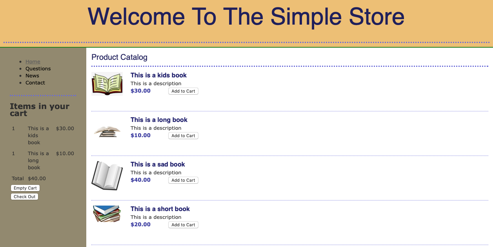
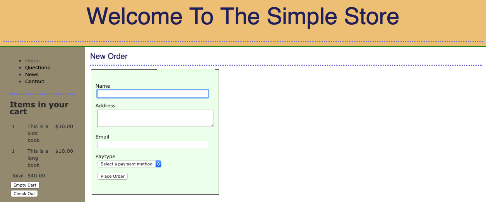
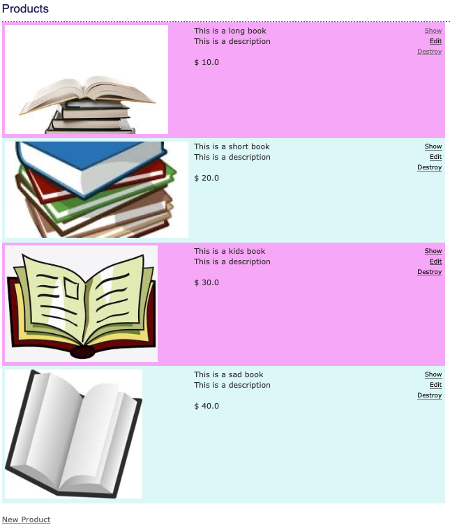
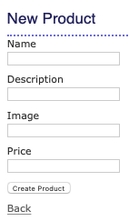

# README

This is a Ruby on Rails Application that allows users to fill their shopping cart with items and allows the users to checkout. The admin, is allowed to modify the products in the store, add new products, and remove products. 

##Frontend: HTML, CSS, and JS
##Backend: Ruby
##Database: Sqlite3

## Main Store View of the Simple Store

## Checkout View 

## Admin Edit Products View

## Admin Add New Product View

